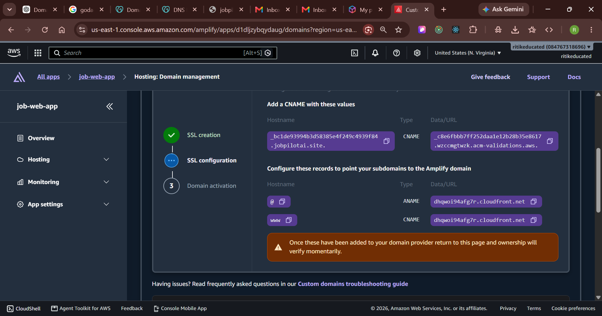
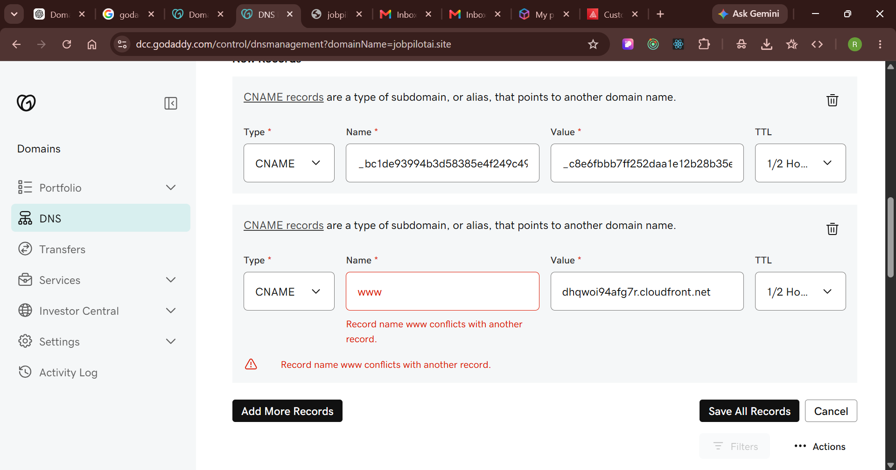
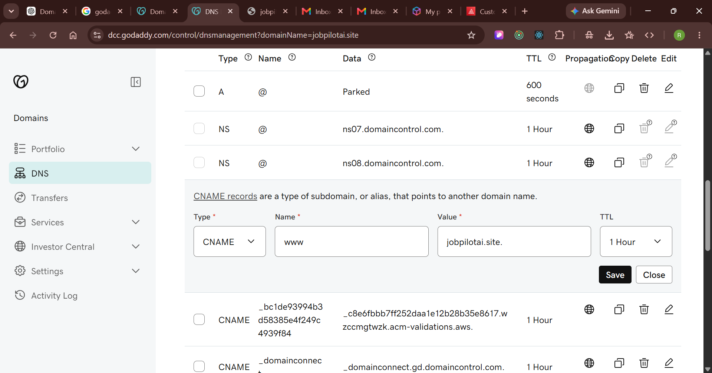

# JobPilotAI — Custom Domain, HTTPS & AWS Billing Guide

- **Project:** JobHook React job app (`frontend_ReactJs`)
- **Domain:** `jobpilotai.site` (bought from GoDaddy)
- **Hosting:** AWS Amplify Hosting (region **US East – N. Virginia, `us-east-1`**)
- **Last updated:** 4 October 2026

This guide records exactly how the React app was connected to the GoDaddy domain with HTTPS on AWS,
how to move the AWS account to a paid plan, and how to make sure you only pay for the services you
actually use. Keep it for future reference.

---

## Table of contents

1. [Quick reference (current setup)](#1-quick-reference-current-setup)
2. [How everything fits together](#2-how-everything-fits-together)
3. [Moving to a paid AWS account](#3-moving-to-a-paid-aws-account)
4. [What you pay for — and only that](#4-what-you-pay-for--and-only-that)
5. [Connecting the GoDaddy domain to AWS Amplify (step by step)](#5-connecting-the-godaddy-domain-to-aws-amplify-step-by-step)
6. [Verification — how we confirmed it works](#6-verification--how-we-confirmed-it-works)
7. [Troubleshooting](#7-troubleshooting)
8. [Future tasks (how to update the site, etc.)](#8-future-tasks)
9. [Useful links](#9-useful-links)

---

## 1. Quick reference (current setup)

| Item | Value |
|---|---|
| Main website (HTTPS) | **https://www.jobpilotai.site** |
| Bare domain | `jobpilotai.site` → redirects (301) to `https://www.jobpilotai.site` |
| Amplify default URL (still works) | https://main.d1dljzybqydaug.amplifyapp.com |
| AWS account ID | `084767318696` |
| AWS region | US East (N. Virginia) — `us-east-1` |
| Amplify app name / ID | `job-web-app` / `d1dljzybqydaug` |
| Amplify branch | `main` (stage: Production) |
| Domain status in Amplify | **AVAILABLE** (verified) |
| SSL certificate | Free, issued and auto-renewed by AWS Certificate Manager (via Amplify) |
| Domain registrar & DNS | GoDaddy (DNS stays at GoDaddy — no Route 53 cost) |
| Backend API used by the app | `https://job-portal-project-1-f7oc.onrender.com` (Render, HTTPS) |
| Old HTTP site | S3 bucket `job-web-app` (static website hosting) — still live, can be removed |

### DNS records added in GoDaddy

| # | Type | Name (Host) in GoDaddy | Value (Points to) | Purpose |
|---|---|---|---|---|
| 1 | CNAME | `_bc1de93994b3d58385e4f249c4939f84` | `_c8e6fbbb7ff252daa1e12b28b35e8617.wzccmgtwzk.acm-validations.aws.` | Proves domain ownership so AWS can issue the SSL certificate |
| 2 | CNAME | `www` | `dhqwoi94afg7r.cloudfront.net` | Sends `www.jobpilotai.site` to the Amplify site |
| 3 | Forwarding | `jobpilotai.site` (root) | `https://www.jobpilotai.site` — Permanent 301, forward only | Makes the bare domain work (GoDaddy cannot point the root at Amplify directly) |

> Keep record #1 forever — AWS uses it to **renew the SSL certificate automatically**. Deleting it
> will make HTTPS fail at the next renewal.

---

## 2. How everything fits together

```
 Visitor's browser
       │  types jobpilotai.site  or  www.jobpilotai.site
       ▼
 GoDaddy DNS ──────────────────────────────────────────────┐
   • jobpilotai.site      → Forwarding 301 → https://www.jobpilotai.site
   • www.jobpilotai.site  → CNAME → dhqwoi94afg7r.cloudfront.net
       │
       ▼
 AWS Amplify Hosting (us-east-1, app "job-web-app", branch "main")
   • HTTPS with free AWS certificate (auto-renewed)
   • Serves the React build (index.html, static/js, images…)
   • Rewrite rule: unknown paths (/find-jobs, /jobs/12 …) → /index.html
       │
       │  the React app calls the API over HTTPS
       ▼
 Backend API on Render  (https://job-portal-project-1-f7oc.onrender.com)
       ▼
 MongoDB Atlas
```

---

## 3. Moving to a paid AWS account

### Do you need it for the domain?
**No.** Adding a custom domain to Amplify and getting the HTTPS certificate works on the free plan
too. Upgrade only if you want to keep the account after the free period ends, or need services the
free plan does not allow.

### Which free offer does your account have?
AWS changed its free offer on **15 July 2025**:

| Account created | What you get | What happens at the end |
|---|---|---|
| Before 15 July 2025 (classic Free Tier) | 12 months of free usage limits (e.g. 750 h/month of a small EC2 server) | Already pay-as-you-go — nothing to upgrade, you are simply billed for usage above the free limits |
| On/after 15 July 2025 (new Free plan) | Up to **$200 credits** ($100 at sign-up + $100 for trying services), valid **6 months** | You must **upgrade to the Paid plan** to keep using the account |

Check in the console: **Billing and Cost Management → Free Tier** (or **Credits**).

### How to upgrade (step by step)
1. Sign in to the AWS Console as the **root user** (or an admin with billing access).
2. Open **Billing and Cost Management** (search "Billing" in the top search bar).
3. Click **"Upgrade plan"** (shown on the Billing home page / Free Tier page while on the Free plan)
   and confirm.
4. Go to **Billing → Payment preferences** and make sure a **valid card** is saved as the default.
5. Done — the account is now **pay-as-you-go**. Any remaining credits keep applying until they expire.

> **Do NOT buy a paid Support plan** (Developer / Business / Enterprise) unless you really need it.
> Keep **Support plan = Basic (free)**. Paid support is a separate monthly subscription.

### Pay-as-you-go in one sentence
AWS has **no monthly subscription for services** — you are charged only for what you use
(per GB stored, per GB served, per build minute, per hour a server runs…). Services you never use cost nothing.

---

## 4. What you pay for — and only that

### Services currently in use

| Service | Used for | Approximate cost |
|---|---|---|
| AWS Amplify Hosting | The website `www.jobpilotai.site` | **~$0–1 / month** for a small site (pennies per GB stored and per GB served) |
| SSL certificate (AWS Certificate Manager, via Amplify) | HTTPS for `jobpilotai.site` | **Free** |
| S3 bucket `job-web-app` (≈14 MB) | Old HTTP site | **< $0.01 / month** → $0 once deleted |
| CloudFront Origin Access Control `E1S124D95W7WI5` | Created during the first (CloudFront) attempt, unused | **Free** |
| GoDaddy DNS + forwarding | Domain records | **Free** (included with the domain) |
| Domain `jobpilotai.site` | Domain name | Paid to **GoDaddy** yearly (not AWS) |
| Backend (Render) + MongoDB Atlas M0 | API and database | **Free** (outside AWS) |

Amplify Hosting price reference (check the official pricing page for current numbers):
build & deploy ≈ $0.01 per minute, storage ≈ $0.023 per GB-month, data served ≈ $0.15 per GB.

### How to make sure you only pay for what you use

1. **Create a budget alert (free)** — Billing → **Budgets** → *Create budget* → *Monthly cost budget*
   → amount **$2** → add your email. AWS emails you before costs grow.
2. **Check the bill monthly** — Billing → **Bills** shows the cost of every service, line by line.
   **Cost Explorer** shows charts by service.
3. **Delete what you don't use**
   - The old S3 bucket `job-web-app` (after you are happy with the HTTPS site).
   - The unused CloudFront Origin Access Control (free, but tidy).
4. **Never leave paid resources running by accident** — EC2 servers, load balancers, NAT gateways,
   unattached Elastic IPs, RDS databases. None are used by this project.
5. **Stay in one region** (`us-east-1` for this project) so you don't forget resources elsewhere.
6. **Remove access keys when not deploying** — IAM → Users → `ritikiam` → *Security credentials*
   → Access keys → **Deactivate → Delete**. Also detach the extra policies if not needed
   (AmazonS3FullAccess, CloudFrontFullAccess, AdministratorAccess-Amplify).
7. **Never share the root password or access keys** with anyone (or paste them into chats).

---

## 5. Connecting the GoDaddy domain to AWS Amplify (step by step)

### Step 1 — Add the domain in AWS Amplify

1. AWS Console → make sure the region (top-right) is **United States (N. Virginia) us-east-1**.
2. Search **Amplify** → open **AWS Amplify** → click the app **`job-web-app`**.
   Direct link: https://us-east-1.console.aws.amazon.com/amplify/apps/d1dljzybqydaug/overview
3. Left menu: **Hosting → Custom domains** → **Add domain**.
4. Enter `jobpilotai.site` → choose **manual DNS configuration** (NOT Route 53 — Route 53 costs
   $0.50/month and GoDaddy DNS is free).
5. Map **`www`** (and root) to the **`main`** branch → **Save**.
6. Amplify creates the SSL certificate and shows the DNS records to add:



*Figure 1 — Amplify "Domain management" page showing the SSL verification CNAME, the `@` (ANAME) and
`www` (CNAME) records. Use the copy buttons to avoid typos.*

### Step 2 — Open DNS in GoDaddy

GoDaddy → **My Products** → `jobpilotai.site` → **DNS** (Manage DNS) → **DNS Records**.
(URL: `https://dcc.godaddy.com/control/dnsmanagement?domainName=jobpilotai.site`)

### Step 3 — Add Record 1: SSL verification (CNAME)

Click **Add New Record**:

| Field | Enter |
|---|---|
| Type | **CNAME** |
| Name | `_bc1de93994b3d58385e4f249c4939f84` |
| Value | `_c8e6fbbb7ff252daa1e12b28b35e8617.wzccmgtwzk.acm-validations.aws.` |
| TTL | Default (1 hour / ½ hour) |

> In **Name**, type **only the part before** `.jobpilotai.site` — GoDaddy adds the domain itself.
> If GoDaddy rejects the trailing dot in **Value**, remove it.

### Step 4 — Record 2: `www` — the "conflict" error and the fix

When we added a **new** `www` CNAME, GoDaddy showed *"Record name www conflicts with another record"*,
because every GoDaddy domain already has a default `www` CNAME pointing to `@`:



*Figure 2 — The new `www` row is rejected. Fix: delete that new row (trash icon), click
**Save All Records** to save the SSL record, then edit the existing `www` record instead.*

**Fix:**
1. Delete the red (new) `www` row with the **trash (Delete)** icon → **Save All Records** (saves Record 1).
2. In the **DNS Records** list, find the row **CNAME · www · jobpilotai.site.** (or `@`) and click the
   **pencil (Edit)** icon.



*Figure 3 — Editing the existing `www` record. Change **Value** from `jobpilotai.site.` to
`dhqwoi94afg7r.cloudfront.net` and click **Save**. The SSL record (`_bc1de93994b3…`) is already
saved below it.*

| Field | Enter |
|---|---|
| Type | **CNAME** |
| Name | `www` |
| Value | `dhqwoi94afg7r.cloudfront.net` |

### Step 5 — Record 3: the root domain (`@`) — use Forwarding

Amplify asks for an **ANAME** record on `@`, but **GoDaddy does not support ANAME/ALIAS**. The free
workaround is GoDaddy **Forwarding**:

1. GoDaddy → domain `jobpilotai.site` → **Forwarding** → **Add Forwarding** (for the domain).
2. **Forward to:** `https://www.jobpilotai.site`
3. **Forward type:** **Permanent (301)**, **Forward only** (no masking) → **Save**.

GoDaddy replaces the default **A @ "Parked"** record automatically when forwarding is saved —
don't edit it manually.

> Want the bare domain (without `www`) to be the main address instead? Move the domain's DNS to
> **Route 53** (~$0.50/month), which supports ALIAS records at the root.

### Step 6 — Wait for verification

Return to **Amplify → Hosting → Custom domains**. The steps turn green in order:
**SSL creation → SSL configuration → Domain activation**. This usually takes **15 minutes to a few
hours** (rarely up to 48 hours). Final status: **Available**.

---

## 6. Verification — how we confirmed it works

| Check | Result |
|---|---|
| Amplify domain status | **AVAILABLE**, `www` subdomain verified |
| SSL record visible on public DNS (Google 8.8.8.8) | ✅ resolves to the `acm-validations.aws` value |
| `https://www.jobpilotai.site` | ✅ HTTP 200, valid certificate, serves the JobHook app |
| `https://www.jobpilotai.site/find-jobs` (page refresh) | ✅ loads the app (rewrite rule works) |
| `http://jobpilotai.site` | ✅ 301 → `https://www.jobpilotai.site` |
| `https://jobpilotai.site` | ✅ 301 → `https://www.jobpilotai.site` |
| Browser console / mixed content | ✅ no errors, all assets on HTTPS |

Commands you can run yourself (Windows terminal):

```bash
nslookup -type=CNAME www.jobpilotai.site 8.8.8.8
nslookup -type=CNAME _bc1de93994b3d58385e4f249c4939f84.jobpilotai.site 8.8.8.8
curl -I https://www.jobpilotai.site
curl -I http://jobpilotai.site
```

Check the domain from the AWS CLI:

```bash
aws amplify get-domain-association --app-id d1dljzybqydaug --domain-name jobpilotai.site --region us-east-1
```

> DNS changes can take time to reach every DNS server. If `nslookup` still shows an old value
> right after editing, wait 30–60 minutes and try again.

---

## 7. Troubleshooting

| Problem | Cause | Fix |
|---|---|---|
| "Record name www conflicts with another record" (GoDaddy) | A default `www` record already exists | **Edit** the existing `www` CNAME instead of adding a new one (Step 4) |
| Amplify stuck on "SSL configuration" | SSL CNAME missing or typed wrong | Check the **Name** doesn't include `.jobpilotai.site` twice; use the copy buttons |
| Bare domain shows GoDaddy "Parked" page | Forwarding not set | Set Forwarding to `https://www.jobpilotai.site` (Step 5) |
| Can't see the app in the Amplify console | Console is in the wrong region | Switch region to **N. Virginia (us-east-1)** |
| Page refresh on `/find-jobs` gives 404 | Rewrite rule missing | Amplify → Hosting → **Rewrites and redirects** — add the SPA rule shown below the table |
| Login/API calls fail with "mixed content" | Backend URL is `http://` | Backend must be **HTTPS** (Render is HTTPS — keep it that way) |
| "Your account must be verified before you can add new CloudFront resources" | New AWS accounts need CloudFront verification | Not needed for Amplify. For plain CloudFront, open a Support case (Account and billing) asking to verify the account |
| HTTPS stops working after ~1 year | SSL validation CNAME was deleted | Re-add Record 1 — it is needed for automatic renewal |
| Unexpected AWS charges | A resource left running | Billing → Bills → find the service → delete the resource; set a budget alert |

**SPA rewrite rule** (Amplify → Hosting → Rewrites and redirects):

| Source address | Target address | Type |
|---|---|---|
| see below | `/index.html` | 200 (Rewrite) |

```
</^[^.]+$|[.](?!(css|gif|ico|jpg|jpeg|js|png|txt|svg|woff|woff2|ttf|map|json|webp|webmanifest)$)([^.]+$)/>
```

---

## 8. Future tasks

### Deploy a new version of the React app (manual)

1. Build the app:
   ```bash
   cd frontend_ReactJs
   npm install
   npm run build
   ```
2. Zip the **contents** of the `build` folder (so `index.html` is at the top of the zip, not inside a
   `build/` folder).
3. Amplify → `job-web-app` → **Deployments** → **Deploy updates / Drag and drop** → upload the zip
   for branch **`main`**.
4. Open https://www.jobpilotai.site and hard-refresh (Ctrl + F5).

Same thing with the AWS CLI:

```bash
aws amplify create-deployment --app-id d1dljzybqydaug --branch-name main --region us-east-1
# -> returns jobId and zipUploadUrl
curl -X PUT -H "Content-Type: application/zip" --data-binary @site.zip "<zipUploadUrl>"
aws amplify start-deployment --app-id d1dljzybqydaug --branch-name main --job-id <jobId> --region us-east-1
```

> Tip: connect Amplify to your **GitHub repository** (Amplify → New branch / Connect repository) to
> deploy automatically on every `git push`.

### Clean up the old HTTP site (optional, recommended)

When you no longer need the old S3 website:
1. S3 → bucket `job-web-app` → **Properties** → *Static website hosting* → **Disable**.
2. **Permissions** → delete the public-read bucket policy and turn **Block all public access** ON.
3. Or delete the bucket completely (empty it first). Amplify does **not** use this bucket.

### Pending: CloudFront account verification

A support case is needed only if you want plain S3 + CloudFront instead of Amplify. Support Center →
*Create case* → **Account and billing** → ask to **verify the account for CloudFront**, include the
error message and account ID `084767318696`.

### Backend on AWS (later)

Possible for free during the free period: EC2 `t3.micro` + Docker, MongoDB Atlas M0, and HTTPS via
CloudFront (after verification) or Caddy/Let's Encrypt with a subdomain such as `api.jobpilotai.site`.
The backend **must be HTTPS** because the website is HTTPS.

---

## 9. Useful links

| What | Link |
|---|---|
| Live website | https://www.jobpilotai.site |
| Amplify app overview | https://us-east-1.console.aws.amazon.com/amplify/apps/d1dljzybqydaug/overview |
| Amplify custom domains | Amplify → `job-web-app` → Hosting → **Custom domains** |
| GoDaddy DNS for the domain | https://dcc.godaddy.com/control/dnsmanagement?domainName=jobpilotai.site |
| AWS Billing home | https://console.aws.amazon.com/billing/home |
| AWS Budgets | https://console.aws.amazon.com/billing/home#/budgets |
| AWS Free Tier usage | https://console.aws.amazon.com/billing/home#/freetier |
| AWS Support Center | https://console.aws.amazon.com/support/home |
| Amplify pricing | https://aws.amazon.com/amplify/pricing/ |
| IAM users (remove access keys) | https://console.aws.amazon.com/iam/home#/users |
